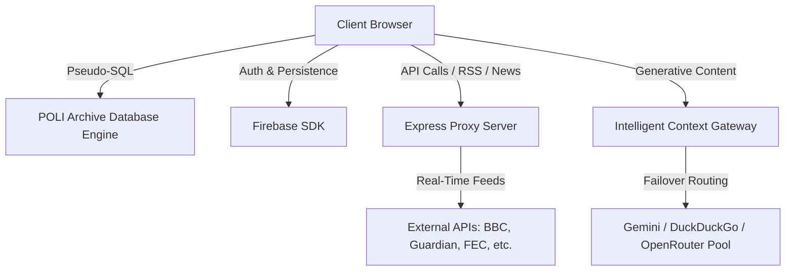
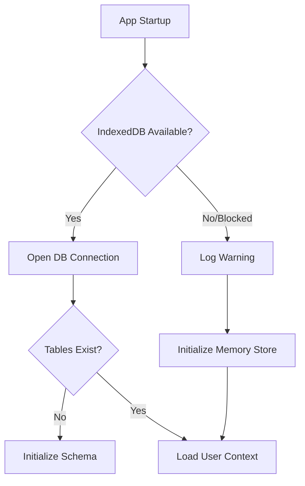

# POLI: A Comprehensive Political Science Research, Simulation, & Curation Workspace

Welcome to **POLI** — an academic-grade, local-first platform designed for political scientists, historians, policy analysts, and students. POLI bridges the gap between structured historical data, geopolitical analysis, ideological taxonomies, and interactive simulations.

The project is built as a client-side React SPA paired with a Node/Express backend that proxies public APIs, aggregates real-time academic feeds, and supports offline-first data persistence.

---

## 🏛️ System Architecture

POLI utilizes a client-first, decoupled architecture optimized for responsiveness, visual polish, and data density:



### 1. Client-Side Rendering & UI Engine
* **Framework**: React 19 + TypeScript, using Vite for hot module reloading and code-split asset bundling.
* **Styling**: Tailwind CSS combined with custom academic typography (Inter, Merriweather, JetBrains Mono) and theme configurations. Supports responsive fluid densities (`Compact` vs `Spacious`), custom border-radii (`None` to `Full`), and localized print stylesheets.
* **Transitions**: Framer Motion for smooth tab transitions and immersive slide-in detail screen overlays.

### 2. Local-First Database Layer (PADE)
* **Engine**: Custom SQL-over-IndexedDB simulation layer (`services/database.ts`).
* **Robust Fallback**: If IndexedDB is blocked or unsupported (e.g. restrictive iframe sandboxes, private browsing sessions), the database engine automatically falls back to an **In-Memory Store** to guarantee that the application initializes and boots successfully without blank screens.
* **Schema**: Matches a structured relational layout across tables: `users`, `saved_items`, `chats`, `messages`, `history_logs`, and `posts`.

### 3. Server Integration & Proxying
* **Backend**: Express server (`server.ts`) acting as an API proxy and asset controller.
* **Wildcard SPA Routing**: Standard Express wildcard routing ensures that client-side routes are correctly redirected to the entry point `index.html` in production.
* **Error Aggregation**: Client-side errors are piped back via `/api/log-error` to the server console for immediate runtime debugging.

---

## 📂 Codebase Directory Layout

```
poli/
├── App.tsx                    # Main App entry, state manager, and router
├── index.tsx                  # ReactDOM bootstrapper wrapped in global ErrorBoundary
├── index.html                 # Entry HTML template with custom metadata & Tailwind configuration
├── tsconfig.json              # TypeScript compilation rules
├── vite.config.ts             # Vite build definitions, process proxies, and aliases
├── package.json               # Package manifests and script definitions
│
├── components/                # UI Components & Detail Screens
│   ├── ErrorBoundary.tsx      # Prevents blank screens on rendering crashes
│   ├── Layout.tsx             # Responsive shell (GlobalHeader + AnimatePresence + Bottom Nav)
│   ├── AuthScreen.tsx         # Guest and Firebase authorization gate
│   ├── LaunchScreen.tsx       # Boot animation with high-fidelity canvas SVG assets
│   ├── tabs/                  # Tab Modules (Home, Almanac, Explore, Countries, Sim, etc.)
│   ├── country/               # Geography, demographic, economy, and education subcomponents
│   └── *DetailScreen.tsx      # 15+ specialized academic detail sheets (e.g. University, Religion)
│
├── services/                  # Business Logic & Integration Layer
│   ├── database.ts            # Pseudo-SQL IndexedDB Engine with In-Memory fallback
│   ├── firebaseService.ts     # Firebase Auth and Firestore persistence initializers
│   ├── homeService.ts         # News aggregation, daily quote, and context loaders
│   ├── geminiService.ts       # Generative AI calls with fallback options
│   ├── soundService.ts        # Synthesized sound effects via browser Web Audio API
│   └── compareService.ts      # Comparative matrix logic
│
├── data/                      # Static Academic & Historical Datasets
│   ├── personsData.ts         # High-density database of historical/political figures (25K+ lines)
│   ├── exploreData.ts         # Structural details for political ideologies, organizations, and disciplines
│   └── homeData.ts            # Fallback trivia and daily briefing metadata
│
└── utils/                     # Helper Modules
    ├── pdfGenerator.ts        # Dossier compilation via jsPDF
    └── searchLogic.ts         # Real-time search query matching
```

---

## 🛠️ Feature Modules

### 1. Daily Briefing Curation
* Fetches current headlines across major global regions using the backend RSS parser (`/api/news`).
* Aggregates real-time open government data (UK Parliament, USA spending, FEC candidates) through query matching.
* Dynamically fetches historical events, political trivia, and customizable context based on the user's selected region.

### 2. Deep Academic Dossiers
POLI hosts interactive, detailed detail screens for over 15 distinct knowledge domains:
* **Countries**: Detailed view of governance systems, economy models, demographic splits, geography profiles, and military complex structures.
* **Political Parties**: Platform breakdowns, historical performance charts, and notable leadership lists.
* **Universities & Religions**: Immersive justified reading pages covering their core tenets, statecraft influence, and geopolitical/historical impact.
* **Historical Figures**: Biographies presented in a responsive two-column grid (restoring optimal desktop readability) along with career timelines, controversies, and political works.

---

## 🎨 Academic Reading & Typography Standards

To ensure long-form text readability across diverse screen sizes, POLI adheres to print-like typesetting guidelines:
* **Alignment & Spacing**: Biographies, statecraft guides, and historical records are set with `text-justify` and `leading-relaxed` (or `leading-8`) to prevent ragged edges.
* **Responsive Spacing**: Dynamic paddings (`p-6 sm:p-8`) shift gracefully between phone viewports and wide tablets.
* **Double Column Grid**: Desktop viewports split biographies into a clean two-column grid, separating raw historical records from interactive timelines and career checklists.
* **Print Stylesheets**: A custom media stylesheet disables sidebars, resets background gradients to clean academic white, and forces page breaks between distinct dossier chapters.

---

## 🏛️ Simulation Parameters & Crisis Engine

The Statebuilder simulation engine uses custom scoring formulas:
* **Structural Attributes**: Form of government (e.g., Technocracy, Oligarchy), economy model (e.g., Laissez-faire, Planned Economy), and cultural focus (e.g., Secularism, Traditionalism).
* **Stability Formula**:
  $$\text{Stability} = \text{Institutions} \times 0.4 + \text{Economy} \times 0.3 + (1.0 - \text{Corruption}) \times 0.3$$
* **Crisis Handling**: Crises validate nation status arrays (e.g. debt-to-GDP, military funding levels) to trigger custom event resolutions.

---

## ⚙️ Database Schema & Resilience Model

The custom `DatabaseService` coordinates a relational SQL-like emulation on top of the browser's IndexedDB.

### Relational Tables
| Table Name | Key Fields | Description |
| :--- | :--- | :--- |
| `users` | `id`, `username`, `email`, `level`, `xp`, `coins` | Manages academic profile progress and stats. |
| `saved_items` | `id`, `type`, `title`, `subtitle`, `dateAdded` | Bookmarked dossiers and theories. |
| `chats` | `id`, `participantName`, `unread`, `archived` | Simulated political debates and dialogues. |
| `messages` | `id`, `conversationId`, `senderId`, `text`, `timestamp` | Message history log for debate simulations. |
| `posts` | `id`, `type`, `title`, `author`, `likes`, `comments` | In-app bulletin board for academic discussions. |

### Fallback State Machine


---

## 🚀 Getting Started

### 1. Install Dependencies
```bash
npm install
```

### 2. Environment Configuration
Duplicate `.env.example` to `.env` and fill in your keys:
```env
GEMINI_API_KEY="your-google-gemini-key"
CLAUDE_API_KEY="your-anthropic-key"
```

### 3. Development Workflow
Start the Vite developer watcher and Express API server in development mode:
```bash
npm run dev
```
Open [http://localhost:3000](http://localhost:3000) in your browser.

### 4. Build and Production Run
Compile frontend assets into standard production-ready HTML/JS/CSS, and bundle the server using `esbuild`:
```bash
npm run build
npm start
```
This serves the optimized static assets directly out of the `dist/` directory.

Enjoy exploring the political universe with POLI.
